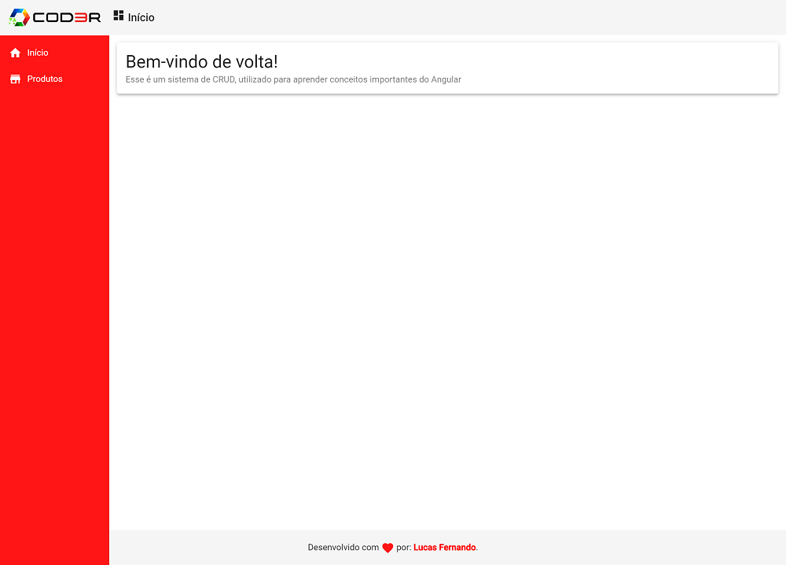
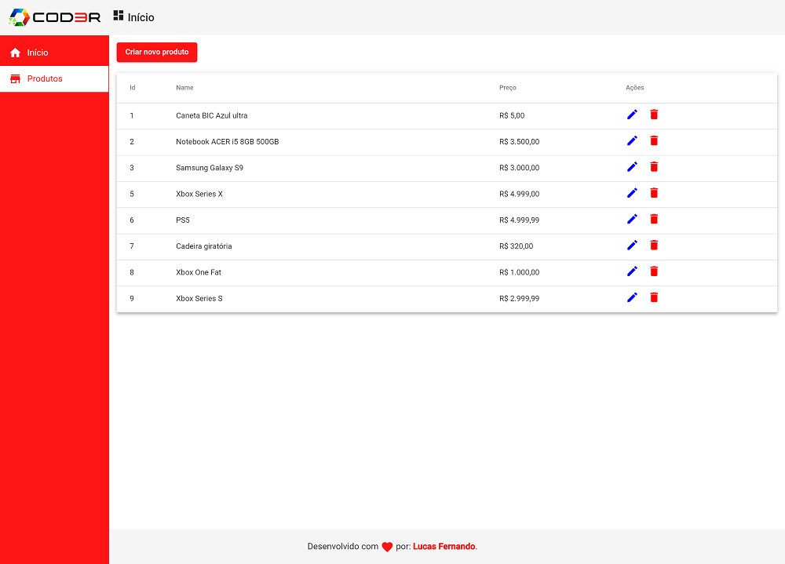
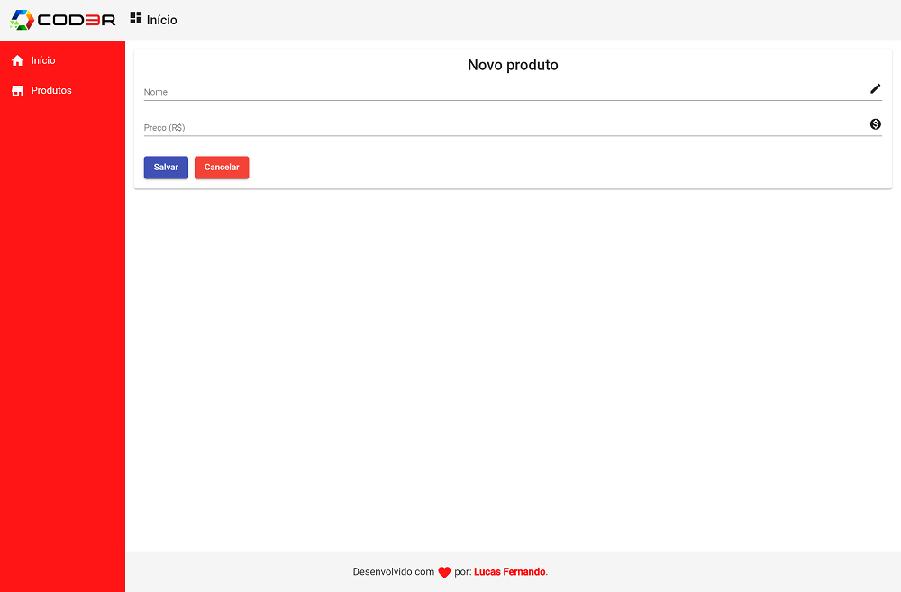
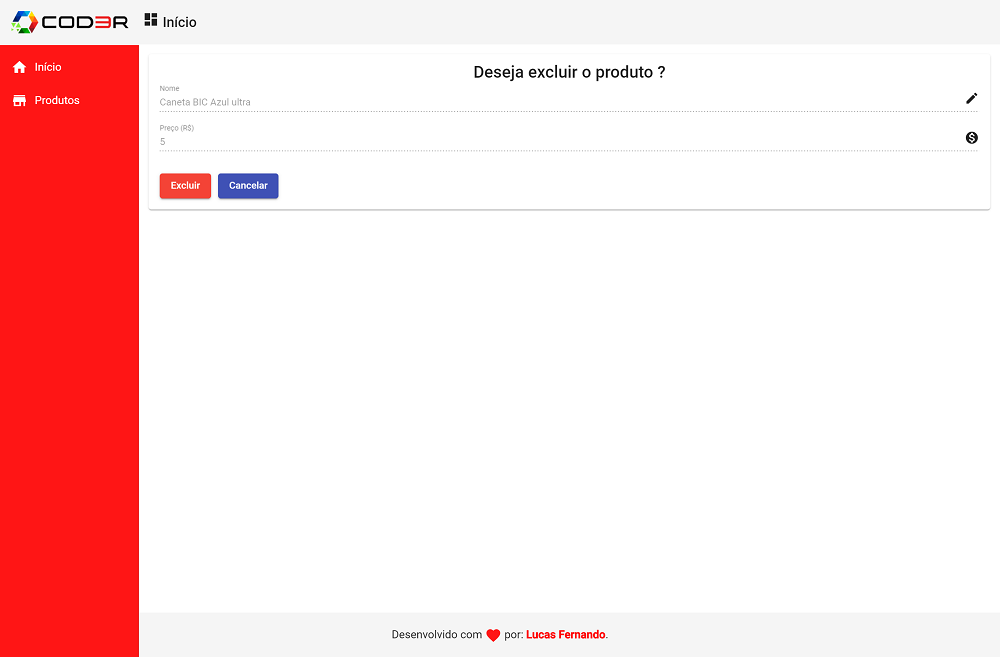

<h1 align="center">CRUD System with Angular</h1>

Products registration system, using Angular - Still under development

<h2>System screens:</h2>

  
<strong>Index:</strong>

    
  
<strong>Read products:</strong>

    
  
<strong>Create products:</strong>

    
  
<strong>Update products:</strong>

    
  
<strong>Delete products:</strong>

    

